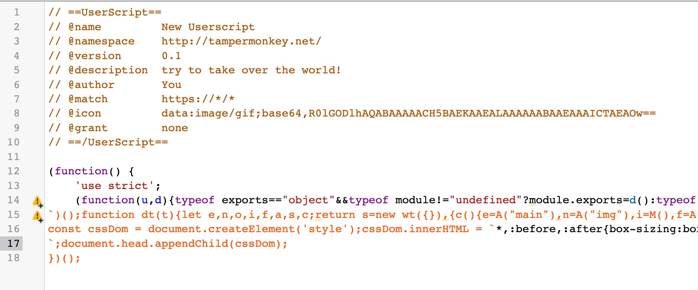

# A template with Svelte + TS + Unocss + Vite to build UI - Tampermonkey script
Svelte , Typescript, Vite

Unocss

unplugin-auto-import

To make building Tampermonkey-script faster

```shell
npx degit SoonIter/tampermonkey-svelte-template my-app
pnpx degit SoonIter/tampermonkey-svelte-template my-app
```


Copy this file to your new Tampermonkey script and write some configs.



Seperate your code in the shadow-root with the main webpage whether js , css or png.
