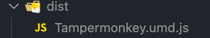

# A template with Svelte + TS + Tailwind + Vite to build UI - Tampermonkey script

To make building Tampermonkey-script faster

Copy this file to your new Tampermonkey script and write some configs.
